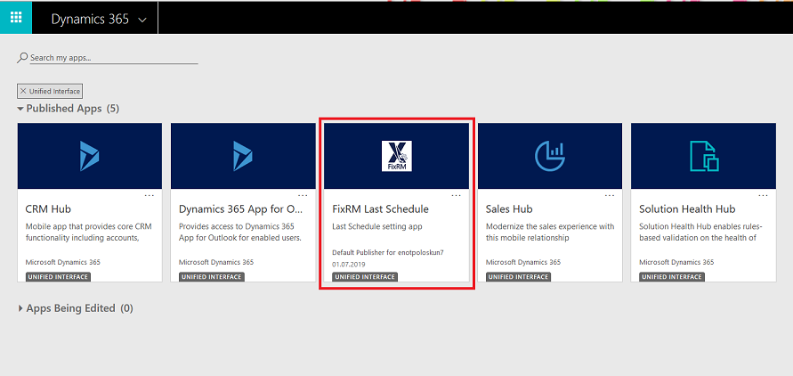
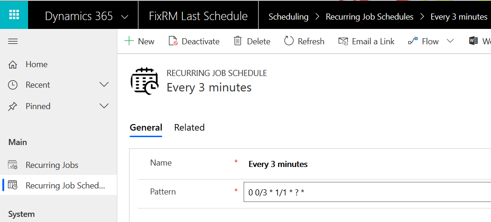
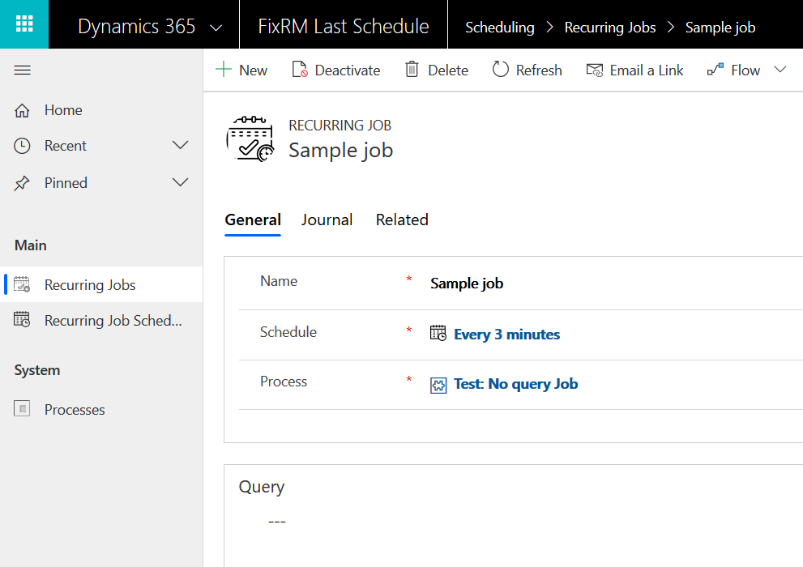
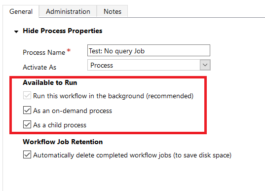
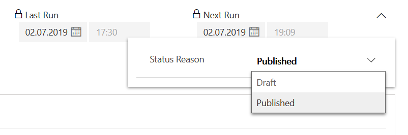

# Last Schedule
Simple but powerful task scheduler for D365 CE

Advantages:
* Recurrence jobs can share common schedules
* Uses Cron scheduling syntax
* Efficient processing and execution
* Easy job life cycle management

## Installation
Please download latest version from [release page](/../../releases) and import solution as usual. It is recommended to use **managed** version for production environment

## Usage
Open "FixRM Last Schedule" app after import:
 

Create a new schedule:

Recurrence pattern is given in [Quartz.NET](https://github.com/quartznet/quartznet) Cron syntax dialect. For simplicity you can use [CronMaker](http://www.cronmaker.com/) online tool to generate pattern

When schedule is created, you can create recurrence job. Required fields are:
* Name. For reference only
* Schedule. Schedule created at previous step
* Process. Process to be executed when job runs
* (Optional) Query. FetchXML query to retrieve records for the job

If query parameter is provided, selected Process will be executed against each record returned by the query. If query parameter is not provided, selected Process will be executed against Job record itself

**Process should be published background (asynchronous) workflow enabled to run on-demand and as child process**

You also may want to configure that process to automatically delete completed jobs to save disk space

To activate job set it's status reason to "Published":

To deactivate process set status reason to back to "Draft" or deactivate job record

## Known issues and limitations
* At the moment, job execution loop process can be executed multiple times for the same record. To avoid this do not change job status to "Activated" state too frequently. This will be fixed in next release
* Processes are currently not available in Unified Interface. As so you have to switch to Classic interface to manage processes. The same thing is with "Journal" tab on the Job form. We hope this limitation will be removed in the upcoming platform releases
* This is a MVP version so functionality is limited to basic tasks. More features are coming soon

## Roadmap
Please vote for the upcoming features in the issues or open new one if something is missed here!
* Error tracking
* Check job parameters before publishing
* Non developer friendly schedule builder UI
* More options for logging/reporting of job results
* On demand job execution

## Contributing
Please fill free to create issue if you find a bug or have an idea

>PR's are welcomed but please open an Issue before doing them as it might be difficult to merge customizations
